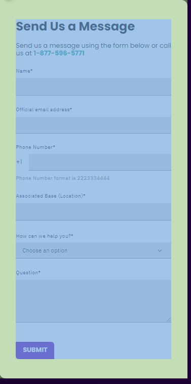
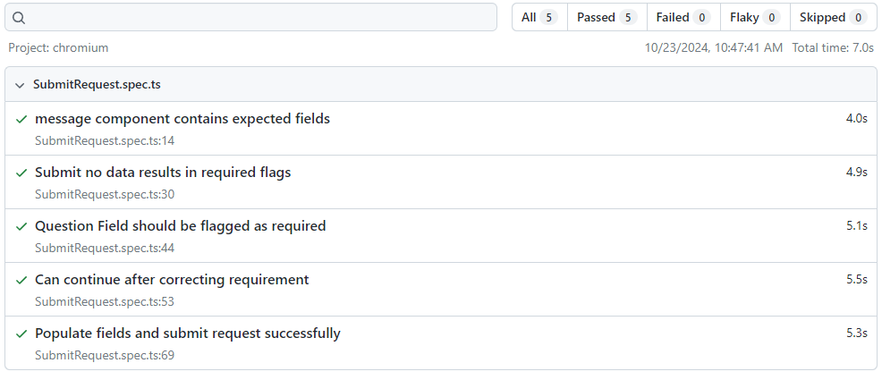

# Digital Uni

## Objective

Demonstrate competency with TypeScript and Playwright by writing Page Objects and tests for the provided page:  
[Digital University Support](https://portal.dev.digitalu.teambespin.us/app/support)

1. In the Support form on the right, enter test data into all but the "Question" field and attempt to submit the form.
2. Validate that you are not able to submit the form and that text appears below the empty "Question" field.
3. Enter test data into all the fields on the form and submit. Validate that you receive a confirmation message on screen.

## Project Structure

The project aims to follow the proper structure for TypeScript/Playwright projects. The current structure includes:

### Components

The goal of a component is to isolate direct Playwright actions within classes, reducing code duplication while improving test readability.

- **base**: Contains basic user interaction components.
- **Support**: Contains a class that encapsulates a collection of components.
- 

### Pages

Contains page objects which include relevant components or collections of components.

- **Support.ts**: [Support Page Object](pages/Support.ts)

## Test Results

### Local

### GitHub Actions

[Test Results via GitHub Actions](https://github.com/jhall217/digital-uni/actions/runs/11483560155/job/31959275209)